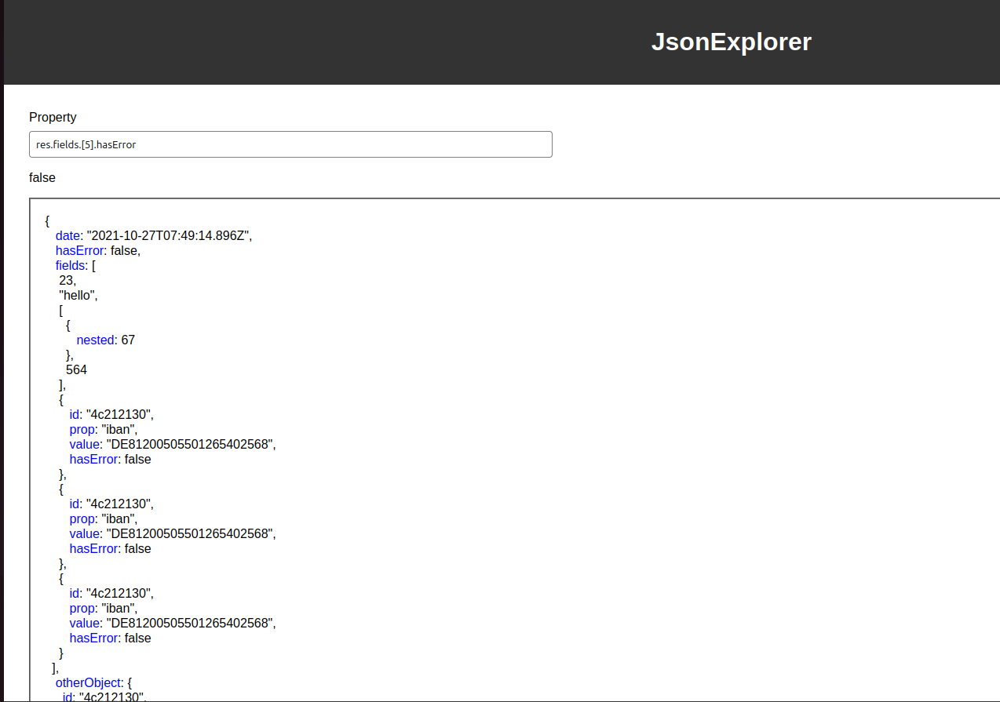

# JSON Explorer

Application that formats a json input, highlights the properties of it and lets you interact with them
to easily visualization.

Built with react.



## requirements

node version: 20+

## installation

on root folder run
```bash
    npm install
```

To run the project do

```bash
    npm run start
```
Then open a browser and search for http://localhost:6969/


To run the project tests do
```bash
    npm run test
```

## When using the project

Some json input examples are provided in the examples folder.
